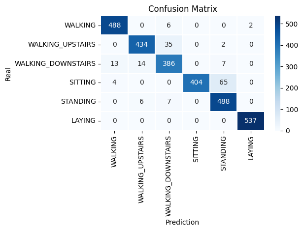

🌡 Human Activity Recognition (WALKING | WALKING_UPSTAIRS | WALKING_DOWNSTAIRS | SITTING | STANDING | LAYING)

## 📦 Teknologies
- 🔍 Model: CNN-LSTM
- 📚 Dataset: Human Activity Recognition Using Smartphones [Dataset](https://archive.ics.uci.edu/dataset/240/human+activity+recognition+using+smartphones)
- 🧠 Training: PyTorch
- 📁 Weights: Stored in `.pth`, auto-loaded on inference

## 🚀 Train Summary
- Epochs: 3
- Loss Function: `nn.CrossEntropyLoss()`
- Optimizer: `Adam`

## Results
- Epoch: 3/3 | Train Loss: 0.036 | Train Acc: 0.989

## Classification Report
  
                        precision    recall  f1-score   support
                    
               WALKING       0.97      0.98      0.98       496           
      WALKING_UPSTAIRS       0.96      0.92      0.94       471  
    WALKING_DOWNSTAIRS       0.89      0.92      0.90       420
               SITTING       1.00      0.85      0.92       473           
              STANDING       0.87      0.97      0.92       501
                LAYING       1.00      1.00      1.00       537
            
              accuracy                           0.94      2898
             macro avg       0.95      0.94      0.94      2898
          weighted avg       0.95      0.94      0.94      2898

